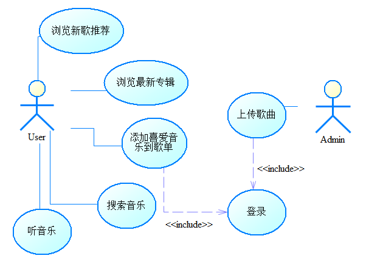
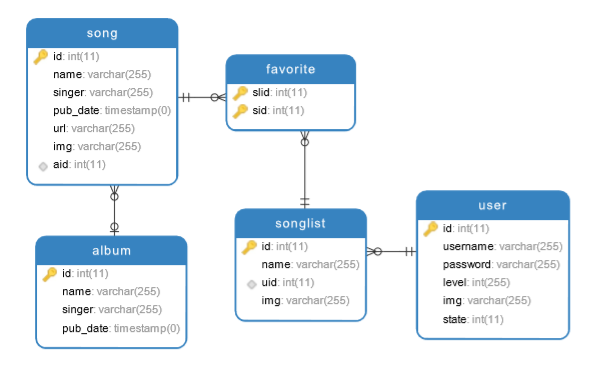
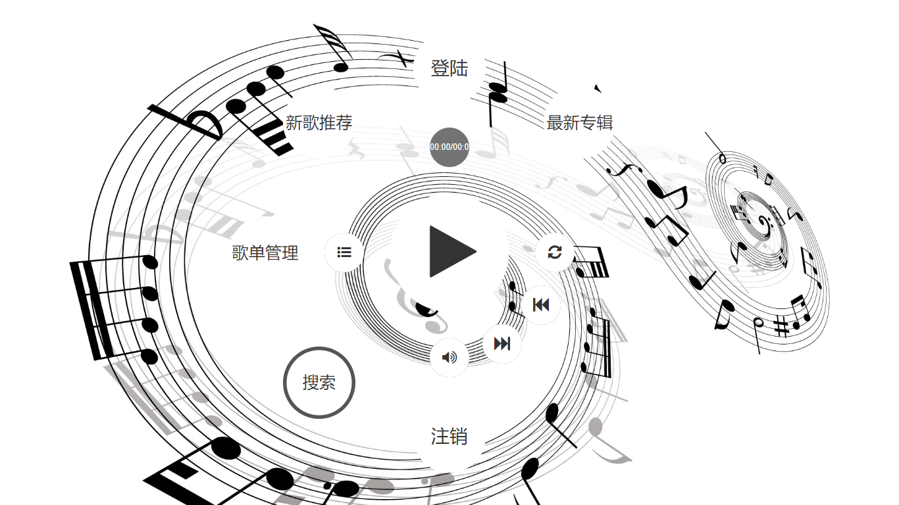
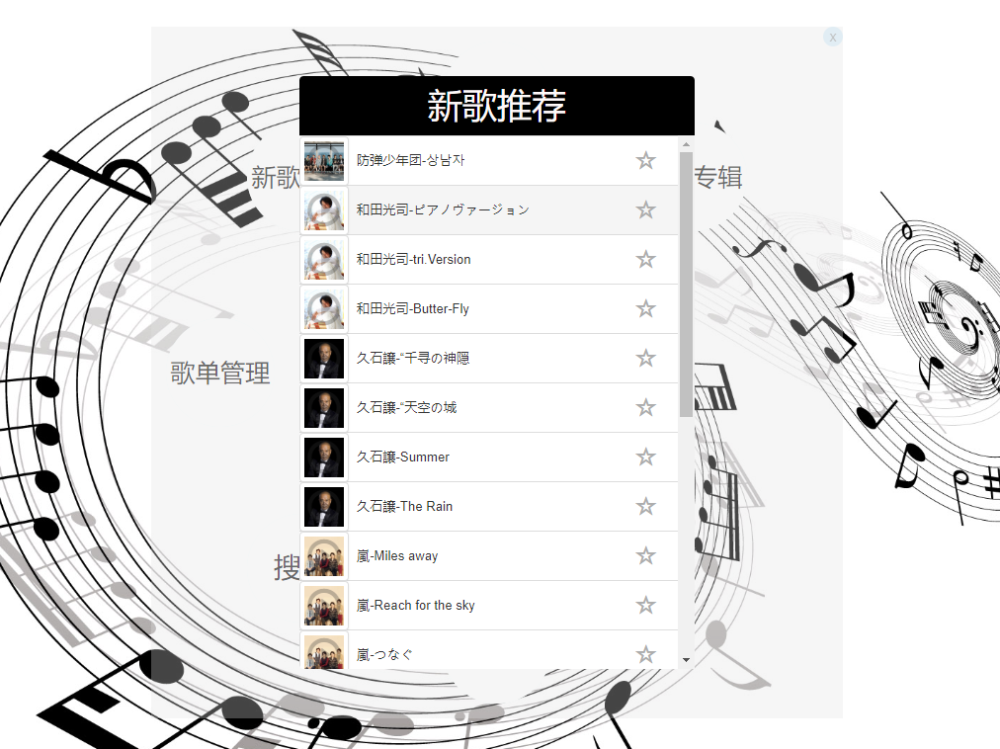
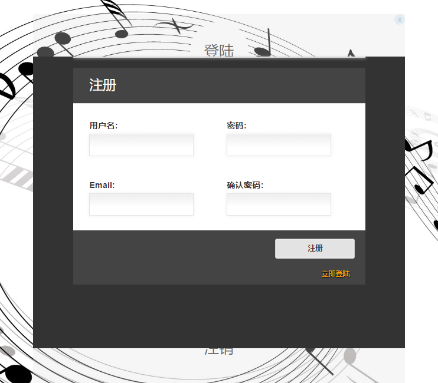
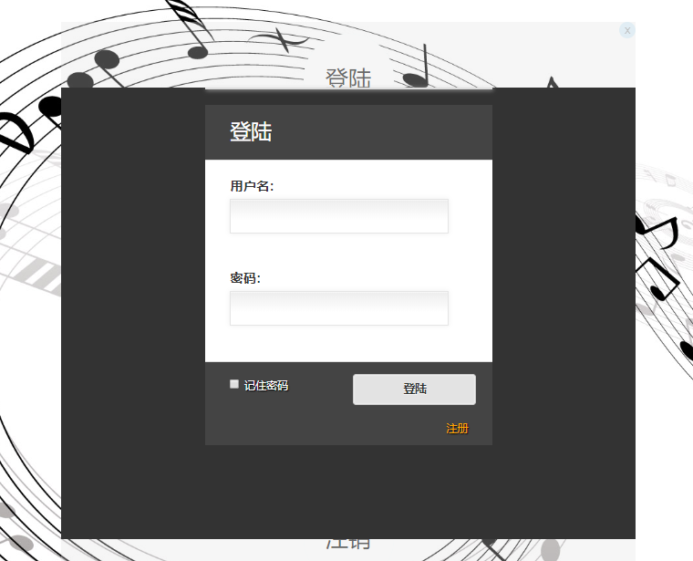
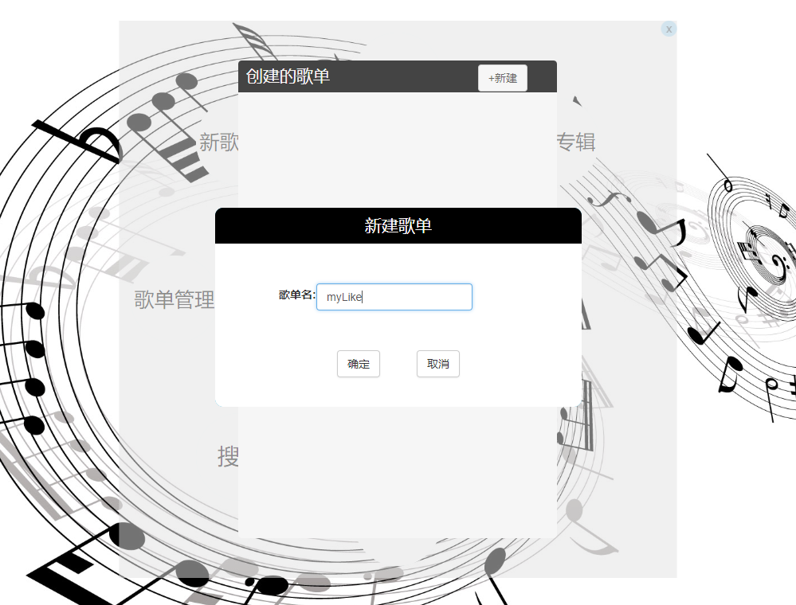
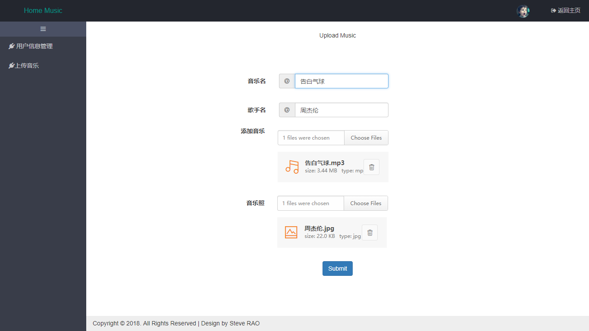

# Home-Music
# 音乐网站

# 1 项目简介

### 1.1 系统介绍
&emsp;&emsp;该项目是一个基于Spring+SpringMVC+Mybatis技术架构下的音乐网站，其为广大用户提供了方便的优质音乐获取途径。该系统存在三类用户——游客、管理员和注册用户。管理员仅负责上传最新音乐到系统。 游客具有查看新歌推荐、最新专辑和搜索喜爱音乐的功能。相比于游客，注册后的用户可以管理自己的歌单，将喜欢的歌曲添加到自己创建的歌单中以便今后随时听取。
### 1.2 技术清单

##### 1.2.1 前端：Html5+js+css、Bootstrap、Jquery插件等

##### 1.2.2 后端：Spring+SpringMVC+Mybatis的JavaEE技术架构

##### 1.2.3 数据库：MySql数据库+Navicat可视化工具

##### 1.2.4 项目设计：PowerDesigner绘制用例图、类图、顺序图和数据库概念和逻辑模型

##### 1.2.5 版本管理：Git+github

# 2 项目重要模型图

### 2.1功能描述

   <h5>图1 功能用例图</h5>

### 2.2 数据库逻辑设计

   <h5>图2 数据库逻辑图</h5>

# 3 项目效果展示

### 3.1 游客或注册用户

   <h5>图3 网站页面</h5>

   <h5>图4 新歌推荐</h5>

   <h5>图5 搜索歌曲</h5>

 

   <h5>图6 注册</h5>

   <h5>图7 登录</h5>

   <h5>图8 注册用户创建自己的新歌单</h5>

### 3.2 管理员用户

   <h5>图9 上传音乐</h5>

